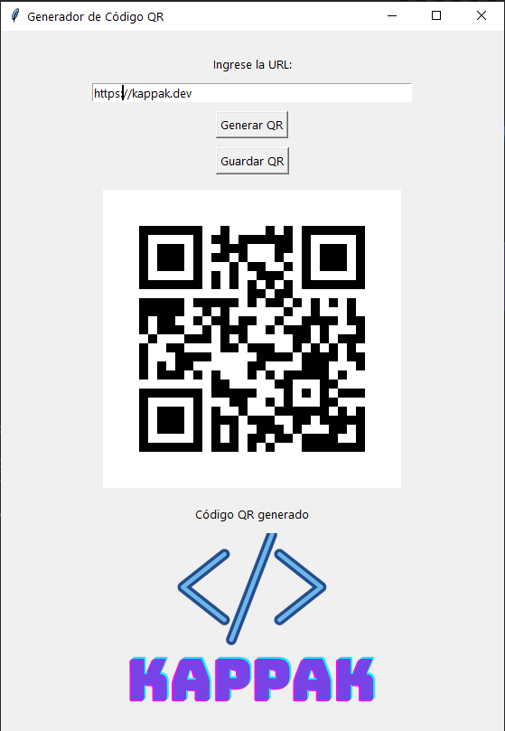

# Generador de Códigos QR

Esta es una aplicación de escritorio sencilla desarrollada en Python utilizando la biblioteca `tkinter` para la interfaz gráfica y la biblioteca `qrcode` para la generación de códigos QR. Permite a los usuarios ingresar una URL y generar un código QR correspondiente, el cual pueden visualizar y guardar como un archivo PNG.

 

## Características Principales

* **Generación de Códigos QR:** Convierte cualquier URL ingresada en un código QR legible.
* **Interfaz Gráfica Intuitiva:** Utiliza `tkinter` para proporcionar una experiencia de usuario amigable.
* **Guardar Códigos QR:** Permite guardar los códigos QR generados como archivos de imagen PNG.
* **Codificación de URL:** Asegura que las URLs complejas se codifiquen correctamente para la generación del QR.
* **Visualización en Tiempo Real:** Muestra el código QR generado directamente en la aplicación.
* **Soporte de Logo (Opcional):** Incluye la funcionalidad para mostrar un logo personalizado en la parte inferior de la ventana (requiere un archivo llamado `logo-kappak.png` en el mismo directorio).

## Requisitos

Para ejecutar esta aplicación, necesitas tener instalado Python en tu sistema. Además, las siguientes bibliotecas deben estar instaladas:

* `tkinter`: Generalmente viene incluido con las instalaciones estándar de Python.
* `qrcode`: Para la generación de códigos QR. Puedes instalarlo con pip:
    ```bash
    pip install qrcode Pillow
    ```
    Nota: `Pillow` es necesario para trabajar con las imágenes generadas por `qrcode`.

## Cómo Utilizar

1.  **Clona el repositorio** (si aún no lo has hecho) a tu máquina local.
2.  **Asegúrate de tener instaladas las dependencias.** Si no las tienes, ejecuta el comando `pip install qrcode Pillow`.
3.  **Ejecuta el script de Python:**
    ```bash
    python tu_script.py
    ```
    (Reemplaza `tu_script.py` con el nombre de tu archivo Python, en este caso, el nombre que le hayas dado al archivo con el código que compartiste).
4.  **Ingresa la URL:** En la ventana de la aplicación, escribe o pega la URL que deseas convertir en un código QR.
5.  **Genera el QR:** Haz clic en el botón "Generar QR". El código QR correspondiente se mostrará en la ventana.
6.  **Guarda el QR:** Si deseas guardar el código QR como un archivo PNG, haz clic en el botón "Guardar QR" y elige la ubicación y el nombre del archivo.

## Personalización (Opcional)

* **Logo:** Para mostrar un logo en la parte inferior de la ventana, coloca un archivo de imagen PNG llamado `logo-kappak.png` en el mismo directorio donde se encuentra el script de Python. Puedes ajustar el tamaño del logo modificando las dimensiones en la línea correspondiente del código.

## Autor

Javier Giraldo

## Licencia

Licencia de Uso No Comercial

Copyright (c) 2025 kappak-dev

POR FAVOR LEA CUIDADOSAMENTE LOS SIGUIENTES TÉRMINOS Y CONDICIONES ANTES DE UTILIZAR ESTE SOFTWARE.

Esta licencia otorga permiso para utilizar el software *QR_code* únicamente para **fines no comerciales**. Se consideran fines no comerciales aquellos que no están dirigidos principalmente a obtener una ventaja comercial o una compensación monetaria. Esto incluye el uso personal, la investigación académica y la evaluación interna.

**Se prohíbe expresamente cualquier uso comercial del Software, incluyendo, pero no limitado a:**

* La integración del Software en productos o servicios que se vendan o se ofrezcan a cambio de una tarifa.
* La utilización del Software para proporcionar servicios a terceros con fines de lucro.
* La distribución del Software con la intención de obtener ganancias económicas.

**Requerimiento de Contacto para Uso Comercial:**

Si usted desea utilizar el Software para cualquier fin comercial, **debe contactar y obtener una licencia explícita por escrito del titular de los derechos de autor**, *Javier Giraldo*, a la siguiente dirección de correo electrónico: *javiergiraldorivera@gmail.com*. La concesión de una licencia comercial estará sujeta a términos y tarifas que se acordarán mutuamente.

**Otras Condiciones:**

* Se permite la copia y distribución del Software para fines no comerciales, siempre y cuando se mantenga intacto este aviso de licencia en todas las copias y se dé el crédito adecuado al titular de los derechos de autor.
* Se prohíbe la modificación del Software sin el permiso explícito por escrito del titular de los derechos de autor.
* EL SOFTWARE SE PROPORCIONA "TAL CUAL", SIN GARANTÍA DE NINGÚN TIPO, EXPRESA O IMPLÍCITA, INCLUYENDO PERO NO LIMITADO A LAS GARANTÍAS DE COMERCIABILIDAD, IDONEIDAD PARA UN PROPÓSITO PARTICULAR Y NO INFRACCIÓN. EN NINGÚN CASO EL AUTOR O LOS TITULARES DE LOS DERECHOS DE AUTOR SERÁN RESPONSABLES DE NINGUNA RECLAMACIÓN, DAÑO U OTRA RESPONSABILIDAD, YA SEA EN UNA ACCIÓN DE CONTRATO, AGRAVIO O DE OTRO TIPO, QUE SURJA DE, O EN CONEXIÓN CON EL SOFTWARE O EL USO U OTROS TRATOS EN EL SOFTWARE.